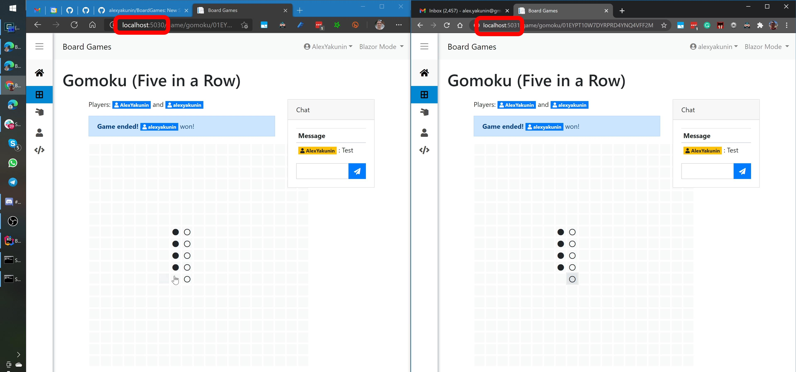

# BoardGames

 Live version of this app: https://boardgames.alexyakunin.com/

 This repository 
wasn't updated for a while, so it uses quite outdated version of Fusion 
(v1.3.x, while the current one is v3.7.x).

"Board Games" is a new [Fusion] sample and a fully functional 
web app allowing you to play real-time multiplayer board games.

A short video explaining what's unique there:

The sample implements a number of features that are 
hard to implement without Fusion. In particular, you might notice
that real-time state sync works literally everywhere in it. 
Try opening the sample in two different browsers, sign in using 
different user accounts, and:
- Create and play a game in both windows
- Check out what happens with game lists when you're
  creating a game, making moves, or posting a chat message
- Try renaming your user & see its name changes everywhere - 
  even in chat mentions!
  
### What's implemented in Board Games

- Two games. I plan to add a couple more  a bit later - 
  there is a common base API allowing to add new games 
  pretty quickly
- Game lobby, where you can track the state of games you
  participate in, browse open games created by other users 
  and join them
- Game chat, which supports mentions. In reality, there is
  an extendable message parser and modular renderer that 
  supports user and game mentions.
- User online/offline status tracking. Notice that every 
  user badge displays it.
- User profile page, where you can edit your user name, add 
  MS/GitHub accounts, see all browser sessions, "kick" some
  of them or sign out from all of them.
- Full state persistence to any DB supported by EF Core
- Web API - it's used when the sample works in Blazor 
  WASM mode, so whatever UI can do is available there too.

Finally, the sample supports *both* Blazor Server and 
Blazor WebAssembly modes.

The [live version] of this app is hosted on Google Cloud GKE:
- The deployment runs 3 replicas of this service on a small
  Kubernetes cluster that includes 3 preemptive
  [e2-small](https://cloud.google.com/compute/vm-instance-pricing#e2_sharedcore_machine_types) 
  nodes ($3.67/mo each)
- Cloud PostgreSql stores the data; it also runs on
  the cheapest 1 core/3.75GB RAM host.
- Both Blazor Server and Fusion require session affinity. 
  It's achieved here with 
  [NGINX Ingress Controller](https://kubernetes.github.io/ingress-nginx/examples/affinity/cookie/)
  configured to route requests to the same backend host
  (selected using consistent hashing) relying on `_ngsa` cookie
- Try opening https://boardgames.alexyakunin.com/api/hostInfo/getHostName
  normally and without this cookie (e.g. in incognito mode) to see 
  how it works. 
- Check out [deployment.yml](deployment.yml), [service.yml](service.yml),
  [ingress.yml](ingress.yml), and [.github/workflows/gke.yml](.github/workflows/gke.yml), 
  if you're interested how to configure this.
                   
### Ok, real-time. But seriously, what's so new there?

The implementation cost of real-time updates. Everything you 
see there required me to write [just 35 extra lines of code](https://github.com/alexyakunin/BoardGames/search?q=IsInvalidating)!

- First 3 `if` blocks have ~ 15 lines of code inside
- The last one (in `GameService.cs`, the invalidation logic is outside of 
  an `if` clause there) has ~ 20 more.
  
And if you look at everything else, it's absolutely usual code you'd 
have otherwise too.

> More precisely, you'd need at least this "everything else" to implement 
a *non-real-time* version of the same sample that supports just 
Blazor Server.
>
> WASM version would require way more - the approach used in this sample,
where server-side services are replaced by their client-side caching
replicas (so-called 
["Replica Services"](https://github.com/servicetitan/Stl.Fusion.Samples/blob/master/docs/tutorial/Part04.md)
in Fusion terms) simply won't work without Fusion-style distributed
version of "computed observable" that eliminates every RPC call known 
to return the same result as the locally cached one. 
>
> In other words, if you use Fusion, Blazor WASM mode has virtually 
zero implementation cost as well. 

**And this is what allowed me build Board Games single-handedly
in 9 days.** Proof: 
[the very first commit](https://github.com/servicetitan/Stl.Fusion.Samples/commit/546ae7597bc7fa3a0b3c7f3b84e3a463bc3fd28f)
cloning Fusion's Blazorise template was made on Feb 1, 
and [I wrote this README describing what's already done](https://github.com/alexyakunin/BoardGames/commit/b1042a74209050cb79fb4e248f84a03c2b600fbf)
on Feb 10 (though at that point there was just one game). 

### Looks interesting, how do I learn more about Fusion?

Check out [Fusion] and its 
[other samples](https://github.com/servicetitan/Stl.Fusion.Samples);
join our [Discord Server] to ask questions.

P.S. I am sure there are some bugs - if you'll find one, 
please 
[report an issue](https://github.com/alexyakunin/BoardGames/issues)!

[Fusion]: https://github.com/servicetitan/Stl.Fusion
[Live version]: https://boardgames.alexyakunin.com/
[Discord Server]: https://discord.gg/EKEwv6d
